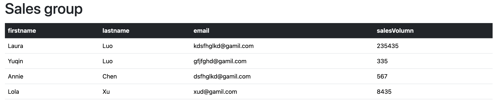
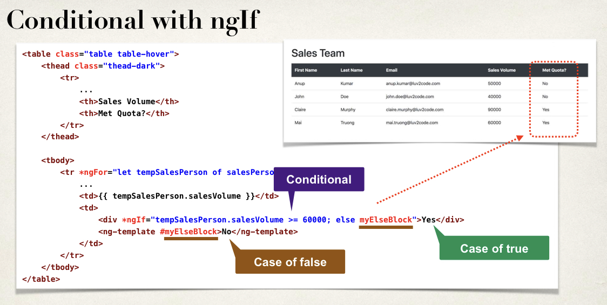

# Fundamentals

1. create angular projects

2. create angular component(sales person table)

   * 这里引入了*ngFor，table list，可以理解为在html里用ts去loop collection

3. integrate angular with bootstrap

   * get bootstrap link, insert link in index.html file
   * apply a div container in the app.component.html file(traditional)
   * apply css style in component html, normally get a copy of the html as bootstrap.component.html, then after the modification, we change the reference in TS component file from previous html file to the copied bootstrap file.

   

4. angular conditional and formatting

   * *ngIf， 可以理解为在html里条件判断

   

   * formatting, 通过**angular pipes**

```
<p> Cost: {{ someValue | currency: 'USD' }} </p> -----> $11.99如果somValue我们给的是11.99
```

